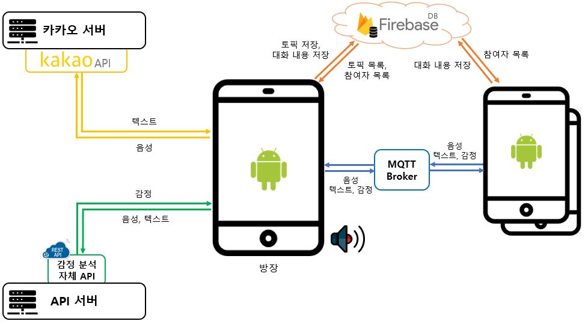
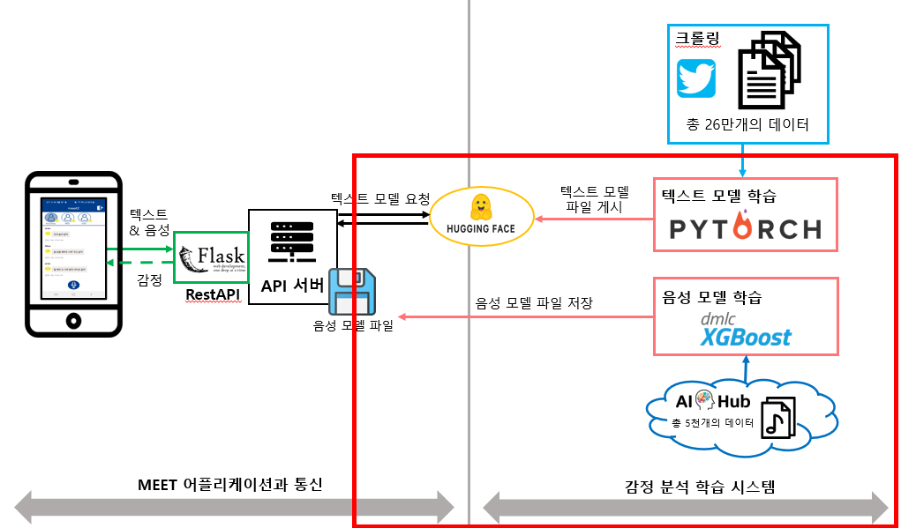
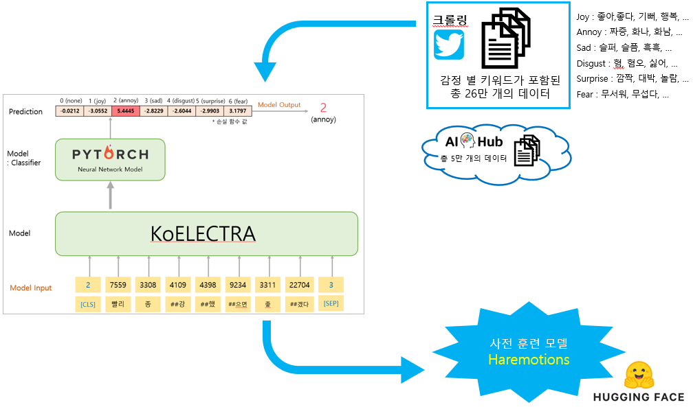
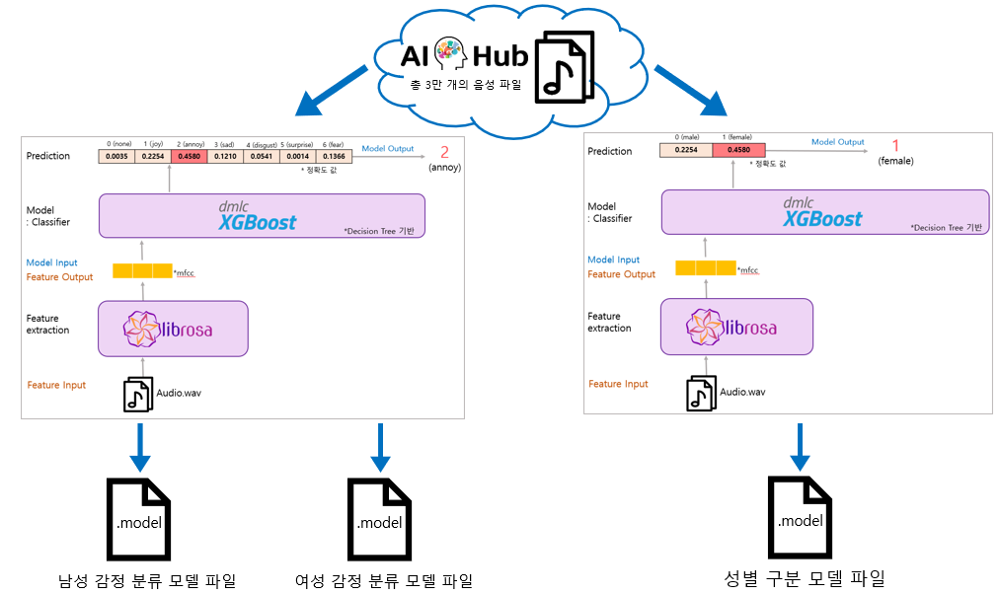

# Meet-sentimentModel

음성과 텍스트를 분석해 **7가지 감정**(중립 / 기쁨 / 슬픔 / 짜증 / 혐오 / 놀람 / 무서움)으로 분류하는 딥러닝 기반 감정 분석 시스템입니다.

비대면 회의·통화 환경에서는 참가자 간 발화가 겹치거나 네트워크 문제로 말을 놓치기 쉽고, 대면 대화에 비해 상대방의 감정을 파악하기도 어렵습니다. 이 프로젝트는 음성을 텍스트로 변환하고 발화 시의 감정을 함께 분석해, 그룹 통화 중 감정과 텍스트를 시각화해 보여주는 애플리케이션 **MEET**의 감정 분석 엔진 부분입니다.

> 2021 캡스톤 디자인 전시회 및 2021 공학경진대회 출품작입니다. 전체 시스템(MEET 앱) 중 **음성·텍스트 감정 분류 학습 시스템** 구축을 담당했습니다.

---

## 목차

- [전체 시스템 구조](#전체-시스템-구조)
- [감정 분석 시스템 구조](#감정-분석-시스템-구조)
- [텍스트 모델](#텍스트-모델)
- [음성 모델 & 성별 구분 모델](#음성-모델--성별-구분-모델)
- [최종 감정 분류 결과 도출 방식](#최종-감정-분류-결과-도출-방식)
- [관련 기술 및 개발 도구](#관련-기술-및-개발-도구)
- [디렉터리 구조](#디렉터리-구조)
- [파일 설명](#파일-설명)
- [함수별 기능](#함수별-기능)
- [개발 중 장애 요인과 해결 방안](#개발-중-장애-요인과-해결-방안)
- [참고 자료](#참고-자료)

---

## 전체 시스템 구조

MEET 앱은 카카오 API로 로그인하고, MQTT Broker를 통해 참가자 간 음성·텍스트·감정 데이터를 주고받으며, Firebase에 대화 내용과 참여자 목록을 저장합니다. 감정 분석은 별도의 API 서버(REST API)에서 처리되어 안드로이드 클라이언트로 전달됩니다.



## 감정 분석 시스템 구조

본 저장소가 담당하는 부분은 아래 구조도의 **빨간색 박스** 영역입니다. Flask 기반 RestAPI 서버가 MEET 앱과 통신하며, 텍스트는 PyTorch로 학습한 모델을, 음성은 XGBoost로 학습한 모델을 호출해 감정을 예측합니다. 학습된 텍스트 모델은 Hugging Face에 게시되어 코드 한 줄로 불러와 사용할 수 있습니다.



---

## 텍스트 모델

### Dataset 구축

- 감정별 키워드를 선정하고, 해당 키워드가 포함된 트윗을 트위터 API로 크롤링해 약 **26만 개**의 데이터를 구축했습니다.

| 감정 | 키워드 |
| --- | --- |
| Joy | 좋아, 좋다, 좋고, 기뻐, 기쁨, 행복, ㄱㅇㄷ, 개이득 |
| Annoy | 짜증, 화나, 화남, 빡ㅊ, 빡침, 빡쳐 |
| Sad | 슬퍼, 슬픔, 흑흑, 우울, 슬프 |
| Disgust | 혐, 혐오, 극혐, 싫어, 싫음 |
| Surprise | 대박, ㄴㅇㄱ, 깜짝, 놀람, 세상에 |
| Fear | 무서워, 지릴뻔, 무섭다 |

- 여기에 AI Hub의 KETI R&D 데이터인 [한국어 감정 정보가 포함된 연속적 대화 데이터셋](https://aihub.or.kr/opendata/keti-data/recognition-laguage/KETI-02-010) 및 단발성 대화 데이터셋(약 5만 개)을 추가해 데이터를 보강했습니다.

### 전처리

문장을 Word2Vec 기반 토크나이저로 토큰화한 뒤 정수 ID로 변환합니다.

```
"빨리 종강했으면 좋겠다"
→ ['[CLS]', '빨리', '종', '##강', '##했', '##으면', '좋', '##겠다', '[SEP]']
→ [2, 7559, 3308, 4109, 4398, 9234, 3311, 22704, 3]
```

### 학습

사전 훈련된 한국어 언어 모델 **KoELECTRA**를 사용했습니다. 다만 KoELECTRA는 기본적으로 감정을 (긍정/부정) 2진 분류만 지원하므로, 은닉층과 출력층(Classification Head)을 직접 추가해 7가지 감정(none, joy, annoy, sad, disgust, surprise, fear)으로 다중 분류할 수 있도록 신경망 모델을 새로 구축했습니다.



### 모델 저장 및 배포

학습된 모델은 **Huggingface transformers**에 `Haremotions`라는 이름으로 등록되어, 별도의 모델 파일 없이도 코드 한 줄로 import해서 사용할 수 있습니다.

---

## 음성 모델 & 성별 구분 모델

### Dataset 구축

- AI Hub의 KETI R&D 데이터 중 [감정 분류를 위한 대화 음성](https://aihub.or.kr/opendata/keti-data/recognition-laguage/KETI-02-002) 데이터셋(.wav 음성 파일 + csv 라벨 파일, 약 3만 개)을 사용했습니다.
- 5명의 라벨러가 각 음성을 7가지 감정(happiness, angry, disgust, fear, neutral, sadness, surprise)으로 라벨링한 결과 중, 가장 많은 표를 받은 감정을 최종 라벨로 사용해 Dataset을 재구축했습니다.

### 전처리

**Librosa**로 음성의 고유한 특징을 수치화한 **MFCC(Mel-Frequency Cepstral Coefficients)** 값을 추출해 학습 Feature로 사용했습니다.

### 학습 & 모델 저장

의사 결정 트리 기반의 **XGBoost**로 학습했습니다. 감정 분류 모델과 별도로, 동일한 파이프라인으로 화자의 성별(남/여)을 구분하는 모델도 함께 구축했습니다. 학습된 모델은 각각 `.model` 파일로 저장됩니다.



---

## 최종 감정 분류 결과 도출 방식

.wav 음성 파일과 발화 텍스트가 입력되면, 음성 모델과 텍스트 모델이 각각 감정을 예측합니다.

- **음성 모델**: 감정별 **정확도(accuracy)** 값을 반환
- **텍스트 모델**: 감정별 **손실 함수(loss)** 값을 반환

두 모델의 출력 스케일이 다르기 때문에, 텍스트 모델의 손실 함수 값 합산이 0에 가깝다는 특성을 이용해 다음 식으로 두 결과를 같은 기준으로 합산했습니다.

```
결과 합산값 = (해당 감정의 손실 함수 값 / 손실 함수 전체 합산 값) + 10
```

합산된 값 중 가장 큰 값을 최종 감정으로 분류합니다.

```text
[0.2712, -0.6164, -0.0957, 0.7323, -0.5343, -0.4390, 0.3032]
------------------------------------
예측 인덱스: 3
감정, 성별 : sad, male
예측 결과   : sad, male
```

---

## 관련 기술 및 개발 도구

| 분류 | 기술 | 설명 |
| --- | --- | --- |
| 언어 | **Python** | 동적 타이핑 범용 언어로, 풍부한 라이브러리와 다른 언어로 작성된 모듈을 연결하는 glue language로서의 역할로 사용 |
| 텍스트 모델 | **KoELECTRA** | ELECTRA 기반 한국어 사전 학습 언어 모델. 34GB의 한국어 텍스트로 학습되었으며 Transformers 라이브러리로 바로 사용 가능 |
| 딥러닝 프레임워크 | **PyTorch** | Torch 기반의 오픈소스 머신러닝 라이브러리로, 텍스트 모델 학습에 사용 |
| 음성 모델 | **XGBoost** | 분산 그라디언트 부스팅 라이브러리로, 음성 감정/성별 분류 모델 학습에 사용 |
| 음성 특징 추출 | **Librosa** | 음성 파일에서 MFCC 등 특징 데이터를 추출 |
| 모델 배포 | **Huggingface** | 학습된 PyTorch 모델을 등록·배포해 코드 한 줄로 다운로드해 사용할 수 있도록 지원 |
| IDE | **PyCharm** | JetBrains의 Python 통합 개발 환경 |
| 형상 관리 | **GitHub** | 코드 버전 관리 및 협업 |

---

## 디렉터리 구조

```
Meet-sentimentModel/
├── audio_model/             # 음성 감정 분류 모델 학습 산출물
├── audio_gender_model/      # 음성 기반 성별 분류 모델 학습 산출물
├── haremotions-v1 ~ v5      # Huggingface에 게시된 텍스트(KoELECTRA 기반) 모델 버전
├── har_model_head.py
├── har_model.py
├── preprocessing_text.py
├── preprocessing_audio.py
├── preprocessing_gender.py
├── sentiment_train_text.py
├── sentiment_train_audio.py
├── sentiment_train_gender.py
├── test_class.py
├── test_text_class.py
├── test_audio_class.py
├── cal_accuracy.py
└── run.py
```

## 파일 설명

**모델 학습 — 음성 모델**

| 파일 | 설명 |
| --- | --- |
| `preprocessing_audio.py` | 음성 파일의 특징 데이터(MFCC)를 추출해 반환 |
| `sentiment_train_audio.py` | 음성 모델을 학습해 `.model` 형식으로 저장 |
| `preprocessing_gender.py` | 성별 분류용 음성 데이터를 전처리 |
| `sentiment_train_gender.py` | 성별 분류 모델을 학습해 `.model` 형식으로 저장 |

**모델 학습 — 텍스트 모델**

| 파일 | 설명 |
| --- | --- |
| `har_model_head.py` | KoELECTRA 모델에 은닉층과 출력층(Classification Head)을 추가 |
| `har_model.py` | 추가된 DNN 모델을 사용해 감정을 예측 |
| `preprocessing_text.py` | 텍스트 Dataset을 전처리해 반환 |
| `sentiment_train_text.py` | 텍스트 모델을 학습해 Huggingface에 업로드할 수 있는 형태로 저장 |

**모델 테스트**

| 파일 | 설명 |
| --- | --- |
| `test_class.py` | 텍스트와 음성 모델을 함께 활용해 최종 감정을 예측 |
| `test_text_class.py` | 텍스트 모델만 활용해 감정을 예측 |
| `test_audio_class.py` | 음성 모델만 활용해 감정을 예측 |
| `cal_accuracy.py` | 준비된 테스트 데이터셋으로 감정별 정확도 및 처리 시간을 측정 |
| `run.py` | 전체 파이프라인 실행 진입점 |

## 함수별 기능

**음성 모델 — `preprocessing_audio.py`**

| 함수 | 설명 |
| --- | --- |
| `extract_mfcc()` | 음성 파일에서 MFCC 값을 추출해 반환 |

**음성 모델 — `sentiment_train_audio.py`**

| 함수 | 설명 |
| --- | --- |
| `most_common_top_1()` | 배열에서 가장 많이 나타난 값을 반환 (Dataset 전처리용) |
| `data_preprocessing()` | 음성 Dataset을 전처리해 MFCC와 label 배열을 반환 |
| `train()` | 전처리한 Dataset으로 학습하고 모델을 `.model` 파일로 저장 |

**텍스트 모델 — `har_model_head.py` (`ElectraClassificationHead` 클래스)**

| 함수 | 설명 |
| --- | --- |
| `forward()` | 입력된 모델에 은닉층과 분류층을 추가해 반환 |

**텍스트 모델 — `har_model.py` (`HwangariSentimentModel` 클래스)**

| 함수 | 설명 |
| --- | --- |
| `forward()` | `ElectraClassificationHead`로 구성된 모델을 사용해 문장의 감정을 예측하고 loss 값 등을 반환 |

**텍스트 모델 — `preprocessing_text.py` (`HwangariDataset` 클래스)**

| 함수 | 설명 |
| --- | --- |
| `__getitem__()` | 문장을 토큰화해 `input_ids`, `attention_mask`, `label`을 반환 |

**텍스트 모델 — `sentiment_train_text.py`**

| 함수 | 설명 |
| --- | --- |
| `train()` | 전처리된 Dataset으로 학습하고 모델을 저장 |
| `draw_graph()` | 학습 중 epoch별 정확도를 그래프로 출력 |

**모델 테스트 — `test_class.py` (`LanoiseClassification` 클래스)**

| 함수 | 설명 |
| --- | --- |
| `classify()` | 음성 파일과 텍스트를 각 모델로 예측한 뒤 결과를 합산해 최종 감정을 반환 |

---

## 개발 중 장애 요인과 해결 방안

**1. 사전 학습된 KoELECTRA가 (긍정/부정) 2진 분류만 지원하는 문제**

| Electra 모델 | 설명 |
| --- | --- |
| `ElectraForPreTraining` | 이진 분류 헤드가 있는 모델 |
| `ElectraForSequenceClassification` | Sequence 분류 헤드가 있는 모델 (RNN 방식) |
| `ElectraForMultipleChoice` | 다중 선택 분류 헤드가 있는 모델 |

기본 제공 Head로는 7가지 다중 분류가 불가능했기 때문에, Head 없이 은닉 상태만 가져오는 `ElectraModel`로 모델을 불러온 뒤 직접 분류층을 추가해 새로운 DNN 모델을 구축하는 방식으로 해결했습니다.

**2. 음성·텍스트 모델의 출력 형식이 서로 다른 문제**

음성 모델은 감정별 정확도를, 텍스트 모델은 감정별 손실 함수 값을 반환해 단순 비교가 불가능했습니다. 텍스트 모델의 손실 함수 합산값이 일정 범위(약 -1~1)를 벗어나지 않는다는 특성에 기반해, 위의 [결과 합산 공식](#최종-감정-분류-결과-도출-방식)으로 두 결과를 동일한 기준에서 비교할 수 있도록 설계했습니다.

---

## 참고 자료

**사용된 Open Source**

- 텍스트 학습 (신경망 모델 은닉층 추가): [nawnoes/WellnessConversation-LanguageModel](https://github.com/nawnoes/WellnessConversation-LanguageModel/blob/master/model/koelectra.py)
- 음성 학습: [shaharpit809/Audio-Sentiment-Analysis](https://github.com/shaharpit809/Audio-Sentiment-Analysis)

**참고 문헌**

- 조요한 외 3인, 「준지도학습을 통한 세부감성 어휘 구축」, 제25회 한글 및 한국어 정보처리 학술대회 논문집, 한국전자통신연구원, 2013.
- 이상우 외 3인, 「기계학습을 활용한 음성인식 감정분석 프로그램 개발」, 한국컴퓨터교육학회 학술대회논문집 22(2), 2018.8, 71-73.
- Marcin, "Custom Classifier On Top Of BERT-LIKE Language Model Guide", 2021. [zablo.net](https://zablo.net/blog/post/custom-classifier-on-bert-model-guide-polemo2-sentiment-analysis/)
- Huggingface, "Model sharing and uploading", 2021. [huggingface.co](https://huggingface.co/transformers/model_sharing.html)
- 박장원, "2주 간의 KoELECTRA 개발기 – 1부", 2021. [monologg.kr](https://monologg.kr/)

---

## Author

**이규영** ([@Kyuyoung11](https://github.com/Kyuyoung11))
